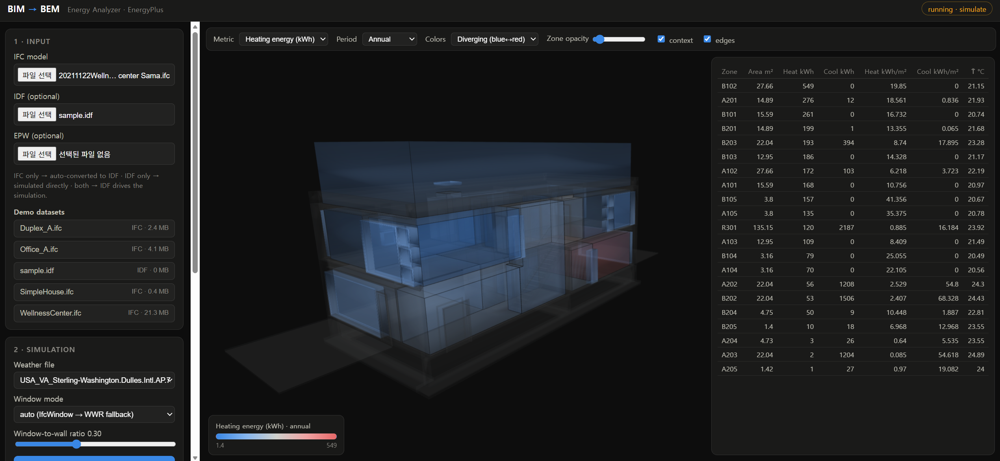
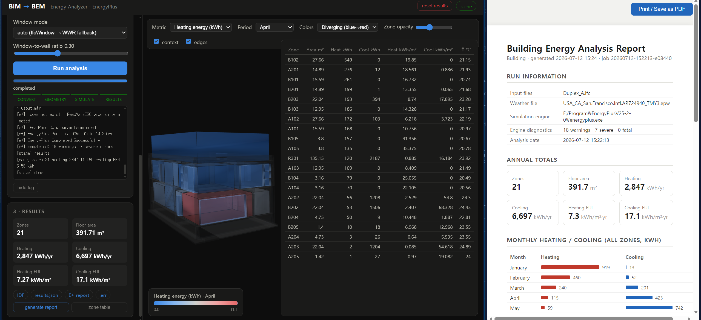
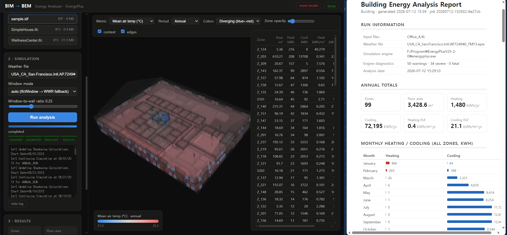
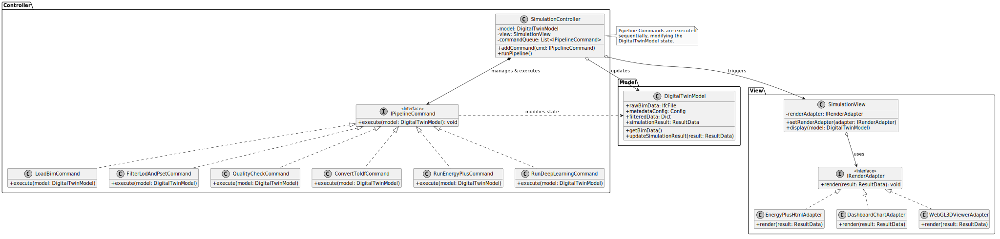

# BIM to BEM Energy Analyzer

Convert BIM models (IFC) into Building Energy Models, run **EnergyPlus** simulations, and explore per-zone results in an interactive **3D web viewer** with energy color mapping.

<p align="center">   
   </img></br>   
   </img>
   </img></br>
   </img>
</p>

```
 IFC / IDF ──▶  pipeline (CLI)  ──▶ EnergyPlus ──▶ results.json ──▶ 3D viewer
               convert · simulate · results · geometry           (Flask + Three.js)
```



## Features

- **IFC → IDF conversion with real geometry** — thermal zones are derived from
  `IfcSpace` solids; boundary surfaces are reconstructed from the space-shell mesh
  (planar clustering + boundary-loop extraction), not from property sets.
- **EnergyPlus integration** — auto-discovers the local EnergyPlus install, runs an
  annual simulation with per-zone `IdealLoadsAirSystem`, and parses monthly per-zone
  heating/cooling energy and air temperatures.
- **3D result viewer** — zones are rendered in the browser (Three.js) and colored by
  the selected metric (heating/cooling kWh, kWh/m², air temperature) with
  sequential / diverging / viridis color schemes, annual or monthly periods, a legend,
  a sortable zone table, and a per-zone monthly chart.
- **Web app is a thin shell** — every analysis runs by spawning the CLI pipeline as a
  subprocess, so the pipeline is fully usable standalone (batch scripts, CI, other UIs).
- **Demo datasets + validation command** included.

## Requirements

| Component | Version tested |
|---|---|
| Python | 3.11 (conda env `venv_lmm` on this machine) |
| EnergyPlus | 25.2 (`F:\Program\EnergyPlusV25-2-0`, auto-discovered) |
| ifcopenshell | 0.8.4 |
| Flask, numpy, pandas, tqdm | see `requirements.txt` |

```powershell
pip install -r requirements.txt
```

EnergyPlus is found automatically (config → `PATH` → common install roots such as
`C:\EnergyPlusV*`, `F:\Program\EnergyPlus*`). To pin a specific install or weather
file, edit `config.json`:

```json
{
  "energyplus_dir": "F:/Program/EnergyPlusV25-2-0",
  "weather_file": "datasets/weather/USA_IL_Chicago-OHare.Intl.AP.725300_TMY3.epw"
}
```

## CLI pipeline

The pipeline is an independent CLI module (`python -m pipeline`). Stages are
composable or can run end-to-end:

```powershell
# full pipeline: IFC -> IDF -> EnergyPlus -> results.json + geometry.json
python -m pipeline run -i datasets/Duplex_A.ifc -o out/duplex `
    -w datasets/weather/USA_IL_Chicago-OHare.Intl.AP.725300_TMY3.epw

# individual stages
python -m pipeline convert  -i building.ifc -o out_dir --wwr 0.35
python -m pipeline geometry -i building.ifc -o geometry.json     # also accepts .idf
python -m pipeline simulate -i model.idf -o ep_out -w weather.epw
python -m pipeline results  -d ep_out -o results.json -m model.json

python -m pipeline weather                # list available EPW files
python -m pipeline validate               # run all demo datasets end-to-end
```

Input rules for `run`:

| Input | Behavior |
|---|---|
| `.ifc` only | converted to IDF, simulated, geometry from IFC spaces |
| `.idf` only | simulated directly, viewer geometry parsed from IDF surfaces |
| `.ifc` + `--idf` | the given IDF drives the simulation; IFC adds visual context |

A job directory contains: `model.idf`, `model.json` (zone metadata), `geometry.json`
(viewer meshes), `ep/` (raw EnergyPlus outputs incl. `eplustbl.htm`), `results.json`,
`run_summary.json`.

## Web application

```powershell
python webapp/app.py --port 5006
# open http://127.0.0.1:5006
```

1. Upload an IFC and/or IDF (plus an optional EPW), or click a demo dataset.
2. Pick the weather file, window mode and WWR, then **Run analysis**. Progress and the
   pipeline log stream into the sidebar.
3. When the run finishes the model appears in the 3D viewer:
   - **Metric** — heating/cooling energy (kWh, kWh/m²), mean/min/max air temperature
   - **Period** — annual or any single month
   - **Colors** — sequential blue (magnitude), diverging blue↔red (temperature), viridis
   - Click a zone (or a zone-table row) for its metrics and monthly heating/cooling chart.
   - Download links: generated IDF, `results.json`, EnergyPlus HTML report, `.err` file.

The Flask layer only manages job folders and progress polling; each run executes
`python -m pipeline run ...` as a subprocess.

## Conversion algorithm

Improvements over naive pset-based converters (details in `pipeline/ifc_parser.py`):

1. **Meshing** — every product is meshed once via `ifcopenshell.geom` in world
   coordinates (meters), multi-core.
2. **Space shell → planar surfaces** — triangles of each `IfcSpace` solid are clustered
   into planar regions (normal angle ≤ 5°, plane offset ≤ 2 cm); each region's outer
   boundary loop is chained from edges used exactly once, simplified (duplicate /
   collinear vertex removal), wound so the Newell normal points out of the zone
   (EnergyPlus convention), and classified Floor / Ceiling / Wall by normal.
3. **Inter-zone adjacency** — opposite-facing surfaces of different zones that overlap
   in-plane (Sutherland–Hodgman clipped area ≥ 30 % of the smaller surface, gap ≤ 0.5 m)
   are paired. EnergyPlus requires paired surfaces to be **exact mirrors**, so both are
   rebuilt from the intersection of their convex hulls, one winding reversed — the same
   idea as OpenStudio's *surface intersection*. Interior surfaces that overlapped a
   neighbor but lost the one-to-one match become **Adiabatic** instead of being wrongly
   exposed to outdoors.
4. **Ground / roof detection** — unmatched floors within 0.3 m of the lowest floor →
   `Ground`; unmatched upward-facing surfaces → `Roof`/`Outdoors`.
5. **Windows** — each `IfcWindow` mesh is projected onto its best-matching external
   wall and inscribed as a rectangle, iteratively shrunk until strictly inside the host
   polygon (an EnergyPlus requirement). Models without usable windows fall back to a
   configurable **window-to-wall ratio** (default 0.3).
6. **No-space fallback** — IFC files without `IfcSpace` (e.g. `SimpleHouse.ifc`,
   `WellnessCenter.ifc`) get one box zone per `IfcBuildingStorey` from that storey's
   element bounding box (the classic "shoebox" BEM simplification), so the pipeline
   still runs end-to-end.
7. **BEM defaults** — U-value-driven constructions, occupancy-scheduled internal loads
   (people / lights / equipment), 0.5 ACH infiltration, 20/26 °C dual setpoints,
   ideal-loads air systems, monthly output variables. All values in `config.json`.

Known limitations: holes in walls other than windows are ignored; curved surfaces are
faceted; zone volumes for the storey fallback are bounding boxes; interior windows and
shading devices are not exported.

## Demo datasets (`datasets/`)

| File | Source | What it exercises |
|---|---|---|
| `Duplex_A.ifc` | buildingSMART / NIBS *Common BIM Files* | 21 spaces, 2nd-level space boundaries, IfcWindow projection |
| `Office_A.ifc` | buildingSMART / NIBS *Common BIM Files* | 99 spaces, 487 walls — scale test |
| `SimpleHouse.ifc` | ifcopenshell sample | no `IfcSpace` → shoebox fallback |
| `WellnessCenter.ifc` | project sample | no spaces, multi-storey fallback |
| `sample.idf` | generated by this pipeline | IDF-only input path |
| `weather/*.epw` | EnergyPlus distribution (TMY3) | San Francisco, Chicago |

Run them all with one command:

```powershell
python -m pipeline validate -w datasets/weather/USA_IL_Chicago-OHare.Intl.AP.725300_TMY3.epw
```

Each case must convert, simulate (EnergyPlus completes), and produce non-empty
per-zone results to PASS.

## Project layout

```
bim_to_bem/
├─ pipeline/            # CLI pipeline (standalone)
│  ├─ cli.py            #   subcommands: convert/geometry/simulate/results/run/validate
│  ├─ ifc_parser.py     #   IFC -> BuildingModel (geometry algorithms)
│  ├─ idf_generator.py  #   BuildingModel -> IDF
│  ├─ ep_runner.py      #   EnergyPlus wrapper
│  ├─ results_parser.py #   eplusout.csv -> results.json
│  ├─ geometry_export.py#   viewer geometry.json (from IFC or IDF)
│  ├─ idf_io.py         #   minimal IDF geometry reader
│  ├─ model.py          #   intermediate model + polygon math
│  └─ config.py         #   config.json, EnergyPlus/EPW discovery
├─ webapp/              # Flask app + Three.js viewer (calls the CLI)
├─ datasets/            # demo IFC/IDF + weather
├─ config.json          # pipeline defaults (loads, constructions, tolerances)
└─ convert_ifc_to_ep.py # legacy prototype (superseded by pipeline/)
```

# License
MIT License

# Author 
Taewook Kang, Ph.D, laputa99999@gmail.com