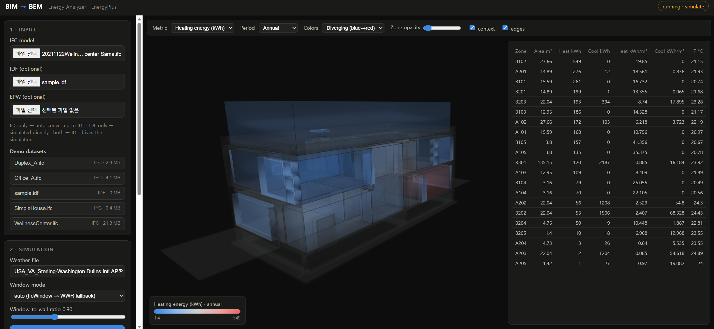
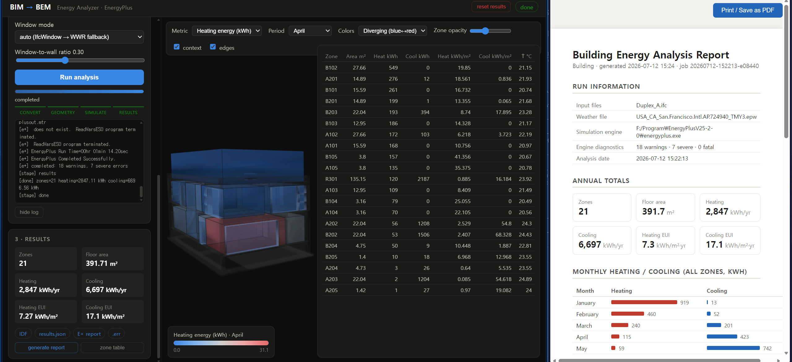
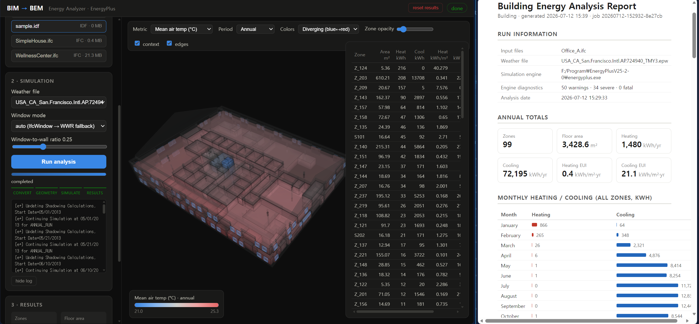
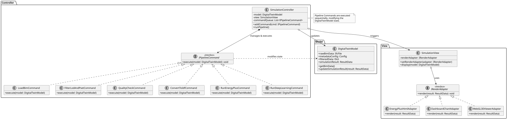

# BIM to BEM Energy Analyzer

Convert BIM models (IFC) into Building Energy Models, run **EnergyPlus** simulations, and explore per-zone results in an interactive **3D web viewer** with energy color mapping.

<p align="center">   
   </img></br>   
   </img>
   </img></br>
   </img>
</p>

```
 IFC / IDF ──▶  pipeline (CLI)  ──▶ EnergyPlus ──▶ results.json ──▶ 3D viewer
               convert · simulate · results · geometry           (Flask + Three.js)
```



## Features

- **IFC → IDF conversion with real geometry** — thermal zones are derived from
  `IfcSpace` solids; boundary surfaces are reconstructed from the space-shell mesh
  (planar clustering + boundary-loop extraction), not from property sets. Windows and
  external doors are projected from their `IfcWindow` / `IfcCurtainWall` / `IfcDoor`
  meshes onto the host wall.
- **Orientation and site data taken from the model and the weather file** — the IFC
  `TrueNorth` sets the EnergyPlus building north axis, and monthly ground temperatures
  come from the EPW header, damped towards the indoor temperature instead of a single
  fixed value.
- **Space-type internal loads** — occupant, lighting and equipment densities are chosen
  per zone from `config.json` → `space_profiles` by keyword in the space name or
  `IfcSpace.LongName` (corridor, toilet, storage, meeting, kitchen, bedroom), falling
  back to the base office values.
- **EnergyPlus integration** — auto-discovers the local EnergyPlus install, runs an
  annual simulation with per-zone `IdealLoadsAirSystem`, and parses monthly per-zone
  heating/cooling energy and air temperatures.
- **Load and estimated energy use side by side** — the ideal thermal load is converted
  into estimated delivered energy with the heat-source efficiency, cooling COP and
  distribution efficiency from `config.json` → `efficiency`, and lighting and equipment
  electricity is reported per zone, so a whole-building EUI can be compared against a
  bill. Load and estimate stay in separate fields.
- **Conversion quality report** — every run records where the zones came from, the
  share of adiabatic surfaces, how the geometric floor area compares with the areas
  stated in the IFC, and the EnergyPlus geometry warnings (unenclosed zones, coincident
  vertices). The figures land in `results.json` and as chips under the results panel, so
  it is visible when a model is too coarse to trust.
- **Runs hand-written IDFs too** — missing monthly output variables are appended to a
  supplied IDF, models with a real air system are read through the
  `Zone Air System Sensible ...` variables, and relative-coordinate geometry (zone
  origin, relative north, multiplier) is resolved for the viewer.
- **3D result viewer** — zones are rendered in the browser (Three.js) and colored by
  the selected metric (heating/cooling load, estimated energy use, kWh/m², air
  temperature) with sequential / diverging / viridis color schemes, annual or monthly
  periods, a legend, a sortable zone table, and a per-zone monthly chart.
- **Web app is a thin shell** — every analysis runs by spawning the CLI pipeline as a
  subprocess, so the pipeline is fully usable standalone (batch scripts, CI, other UIs).
- **Demo datasets + validation command** included.

## Requirements

| Component | Version tested |
|---|---|
| Python | 3.11 (conda env `venv_lmm` on this machine) |
| EnergyPlus | 25.2 (`F:\Program\EnergyPlusV25-2-0`, auto-discovered) |
| ifcopenshell | 0.8.4 |
| Flask, numpy, pandas, tqdm | see `requirements.txt` |

```powershell
pip install -r requirements.txt
```

[EnergyPlus](https://energyplus.net/downloads) is found automatically (config → `PATH` → common install roots such as
`C:\EnergyPlusV*`, `F:\Program\EnergyPlus*`). To pin a specific install or weather
file, edit `config.json`:

```json
{
  "energyplus_dir": "F:/Program/EnergyPlusV25-2-0",
  "weather_file": "datasets/weather/USA_IL_Chicago-OHare.Intl.AP.725300_TMY3.epw"
}
```

## CLI pipeline

The pipeline is an independent CLI module (`python -m pipeline`). Stages are
composable or can run end-to-end:

```powershell
# full pipeline: IFC -> IDF -> EnergyPlus -> results.json + geometry.json
python -m pipeline run -i datasets/Duplex_A.ifc -o out/duplex `
    -w datasets/weather/USA_IL_Chicago-OHare.Intl.AP.725300_TMY3.epw

# individual stages
python -m pipeline convert  -i building.ifc -o out_dir --wwr 0.35 -w weather.epw
python -m pipeline geometry -i building.ifc -o geometry.json     # also accepts .idf
python -m pipeline simulate -i model.idf -o ep_out -w weather.epw
python -m pipeline results  -d ep_out -o results.json -m model.json

python -m pipeline weather                # list available EPW files
python -m pipeline validate               # run all demo datasets end-to-end
```

Input rules for `run`:

| Input | Behavior |
|---|---|
| `.ifc` only | converted to IDF, simulated, geometry from IFC spaces |
| `.idf` only | simulated directly, viewer geometry parsed from IDF surfaces |
| `.ifc` + `--idf` | the given IDF drives the simulation; IFC adds visual context |

A job directory contains: `model.idf`, `model.json` (zone metadata), `geometry.json`
(viewer meshes), `ep/` (raw EnergyPlus outputs incl. `eplustbl.htm`), `results.json`,
`run_summary.json`.

## Web application

```powershell
python webapp/app.py --port 5006
# open http://127.0.0.1:5006
```

1. Upload an IFC and/or IDF (plus an optional EPW), or click a demo dataset.
2. Pick the weather file, window mode and WWR, then **Run analysis**. Progress and the
   pipeline log stream into the sidebar.
3. When the run finishes the model appears in the 3D viewer:
   - **Metric** — heating/cooling load, estimated energy use (kWh, kWh/m²),
     mean/min/max air temperature
   - **Period** — annual or any single month
   - **Colors** — sequential blue (magnitude), diverging blue↔red (temperature), viridis
   - Click a zone (or a zone-table row) for its metrics and monthly heating/cooling chart.
   - Download links: generated IDF, `results.json`, EnergyPlus HTML report, `.err` file.
   - Quality chips under the totals flag a coarse conversion (shoebox zones, adiabatic
     share, floor-area deviation, unenclosed zones).

The Flask layer only manages job folders and progress polling; each run executes
`python -m pipeline run ...` as a subprocess.

## Conversion algorithm

Improvements over naive pset-based converters (details in `pipeline/ifc_parser.py`):

1. **Meshing** — every product is meshed once via `ifcopenshell.geom` in world
   coordinates (meters), multi-core.
2. **Space shell → planar surfaces** — triangles of each `IfcSpace` solid are clustered
   into planar regions (normal angle ≤ 5°, plane offset ≤ 2 cm); each region's outer
   boundary loop is chained from edges used exactly once, simplified (duplicate /
   collinear vertex removal), wound so the Newell normal points out of the zone
   (EnergyPlus convention), and classified Floor / Ceiling / Wall by normal.
3. **Inter-zone adjacency** — opposite-facing surfaces of different zones that overlap
   in-plane (Sutherland–Hodgman clipped area ≥ 30 % of the smaller surface, gap ≤ 0.5 m)
   are paired. EnergyPlus requires paired surfaces to be **exact mirrors**, so both are
   rebuilt from the intersection of their convex hulls, one winding reversed — the same
   idea as OpenStudio's *surface intersection*. Interior surfaces that overlapped a
   neighbor but lost the one-to-one match become **Adiabatic** instead of being wrongly
   exposed to outdoors.
4. **Ground / roof detection** — unmatched floors within 0.3 m of the lowest floor →
   `Ground`; unmatched upward-facing surfaces → `Roof`/`Outdoors`.
5. **Windows and doors** — each `IfcWindow`, `IfcCurtainWall` and `IfcDoor` mesh is
   projected onto its best-matching external wall and inscribed as a rectangle,
   iteratively shrunk until strictly inside the host polygon (an EnergyPlus
   requirement); doors get their own opaque construction. Models without usable windows
   fall back to a configurable **window-to-wall ratio** (default 0.3).
6. **No-space fallback** — IFC files without `IfcSpace` (e.g. `SimpleHouse.ifc`,
   `WellnessCenter.ifc`) get one box zone per `IfcBuildingStorey` from that storey's
   element bounding box (the classic "shoebox" BEM simplification), so the pipeline
   still runs end-to-end.
7. **BEM defaults** — U-value-driven constructions, occupancy-scheduled internal loads
   (people / lights / equipment) picked per space profile, 0.5 ACH infiltration,
   20/26 °C dual setpoints, ideal-loads air systems, monthly output variables. The
   building north axis comes from the IFC `TrueNorth` and the ground temperatures from
   the EPW header. All values in `config.json`.

Known limitations: holes in walls other than windows are ignored; curved surfaces are
faceted; zone volumes for the storey fallback are bounding boxes; interior windows and
shading devices are not exported. See [Known limitations & roadmap](#known-limitations--roadmap)
for the full scope and accuracy boundaries.

## Demo datasets (`datasets/`)

| File | Source | What it exercises |
|---|---|---|
| `Duplex_A.ifc` | buildingSMART / NIBS *Common BIM Files* | 21 spaces, 2nd-level space boundaries, IfcWindow projection |
| `Office_A.ifc` | buildingSMART / NIBS *Common BIM Files* | 99 spaces, 487 walls — scale test |
| `SimpleHouse.ifc` | ifcopenshell sample | no `IfcSpace` → shoebox fallback |
| `WellnessCenter.ifc` | project sample | no spaces, multi-storey fallback |
| `sample.idf` | generated by this pipeline | IDF-only input path |
| `weather/*.epw` | EnergyPlus distribution (TMY3) | San Francisco, Chicago |

Run them all with one command:

```powershell
python -m pipeline validate -w datasets/weather/USA_IL_Chicago-OHare.Intl.AP.725300_TMY3.epw
```

Each case must convert, simulate (EnergyPlus completes), and produce non-empty
per-zone results to PASS.

## Project layout

```
bim_to_bem/
├─ pipeline/            # CLI pipeline (standalone)
│  ├─ cli.py            #   subcommands: convert/geometry/simulate/results/run/validate
│  ├─ ifc_parser.py     #   IFC -> BuildingModel (geometry algorithms)
│  ├─ idf_generator.py  #   BuildingModel -> IDF
│  ├─ ep_runner.py      #   EnergyPlus wrapper
│  ├─ results_parser.py #   eplusout.csv -> results.json
│  ├─ geometry_export.py#   viewer geometry.json (from IFC or IDF)
│  ├─ idf_io.py         #   minimal IDF geometry reader
│  ├─ model.py          #   intermediate model + polygon math
│  └─ config.py         #   config.json, EnergyPlus/EPW discovery
├─ webapp/              # Flask app + Three.js viewer (calls the CLI)
├─ datasets/            # demo IFC/IDF + weather
├─ config.json          # pipeline defaults (loads, constructions, tolerances)
└─ convert_ifc_to_ep.py # legacy prototype (superseded by pipeline/)
```

## Known limitations & roadmap

Scope and accuracy boundaries of the current pipeline. Read this before comparing the
output against measured (metered) building energy.

### 1. What the IFC does not contribute

| IFC data | Effect on the model |
|---|---|
| `IfcZone` grouping | spaces are never merged: a 20-space floor served by one AHU becomes 20 EnergyPlus zones |
| HVAC / MEP entities (`IfcSystem`, `IfcBoiler`, `IfcChiller`, `IfcCoil`, `IfcFan`, …) | the mechanical design has **no effect** on the results |
| Material and layer properties | six generic U-value assemblies are applied by surface type instead |
| `IfcSite` latitude / longitude / elevation | the weather file defines the location (it would only matter for design-day sizing, which is not run) |
| Second and further `IfcBuilding` | merged into one flat model; only the first building's name is kept |

Thermal zones come from `IfcSpace` solids (one zone per space), or from storey bounding
boxes when a model has no spaces, or from a single whole-building box as a last resort.
Because zones are never merged, surface-to-surface matching between spaces dominates
runtime on large models.

Every zone then receives the same synthetic system: a dual-setpoint thermostat
(20 / 26 °C), a `ZoneHVAC:IdealLoadsAirSystem` with unlimited capacity, and ASHRAE 62.1
outdoor air. Two buildings with radically different mechanical designs produce identical
output if their envelopes match.

### 2. Results are zone *load*; energy use is an estimate on top

The pipeline solves nothing itself — it writes an IDF, runs EnergyPlus and reads the
monthly zone heating and cooling energy back. Because the ideal-loads system is
lossless, `heating_kwh` / `cooling_kwh` are **thermal demand**: no COP or part-load
performance, no boiler efficiency, no fan or pump power, no duct and pipe losses, and no
heat recovery, economizer or defrost.

`heating_energy_kwh` / `cooling_energy_kwh` convert that demand into estimated delivered
energy using the constant factors in `config.json` → `efficiency`, and `energy_kwh` adds
the reported lighting and equipment electricity on top. That is a bill-scale sanity
check, not a plant model: the factors ignore load, outdoor temperature and run hours,
auxiliary energy is missing, and end uses outside the model (hot water, lifts, external
lighting) are not counted at all. A real comparison needs a modelled plant.

Two further reporting limits: no sizing run and no design days, so peak loads and
equipment capacities are never produced; and monthly output only, so annual figures are
sums of months and the reported minimum / maximum temperatures are extremes of monthly
means, not hourly peaks.

### 3. Other simplifying assumptions

- **Internal loads are keyword-matched.** Space profiles are picked by substring in the
  space name or `IfcSpace.LongName`, not by an IFC classification, so an unnamed or
  unusually named space falls back to the office defaults. Within a profile every zone
  shares the same densities and occupancy schedule, and there are no daylighting
  controls.
- **Constant infiltration.** 0.5 ACH around the clock, driven by neither wind nor
  temperature difference. No natural ventilation or operable windows.
- **Simplified solar.** Transmitted solar is distributed onto the floor and exterior
  reflections are ignored; surrounding buildings are drawn in the viewer but never
  written as shading surfaces.
- **Openings are rectangles on external walls.** Windows and doors are inscribed as a
  shrunk rectangle in the best-matching external wall, without frame, divider or shading
  control. Interior doors and openings that miss an external wall are dropped, and the
  `wwr` / `none` window modes place no doors at all.
- **Geometry is simplified.** Holes other than windows and doors are discarded, tiny
  surfaces are dropped, surfaces with very many vertices are replaced by their convex
  hull (which inflates concave walls), curves are faceted, and shoebox-fallback zone
  volumes are bounding boxes.
- **Unmatched interior surfaces become adiabatic** rather than exposed outdoors — safer
  than a wrong exterior boundary, but it removes a real heat path.
- **Ground contact is a damped weather-file profile.** Undisturbed monthly ground
  temperatures are blended towards the heating setpoint by a single factor
  (`site.ground_coupling`), which is not a slab or ground-domain model and carries no
  perimeter insulation.

The `quality` block in `results.json` reports how the conversion went — zone source,
adiabatic share, floor-area deviation against the IFC, unenclosed zones — but it is a
plausibility check, not validation: passing it does not make the absolute numbers
correct.

### 4. Hand-written IDF input

An IDF supplied directly is simulated essentially as written — only the monthly output
variables needed for per-zone results are appended — and it is re-read just far enough
to draw the viewer, by a text reader rather than a validating parser:

- Only `Zone`, `BuildingSurface:Detailed` and `FenestrationSurface:Detailed` are drawn.
  The simplified geometry objects (`Wall:Exterior`, `Roof`, `Window`, `Door`, …),
  shading surfaces and internal mass are invisible, so such a model renders empty even
  though the simulation succeeds.
- Vertex blocks are located heuristically, so EpMacro / `##include` files and commas
  inside quoted names break the reader. No version check or version transition is done.
- Relative coordinates are resolved per zone (origin, relative north, multiplier), but
  the building north axis is not applied — a rotated building is drawn in model
  orientation, the same convention the IFC path uses.
- Zone floor area and volume are re-derived from the geometry rather than read from the
  `Zone` object: area is the floor surfaces times the multiplier (a zone without a floor
  surface gets 0 m², hence no kWh/m²) and volume is that area times the zone height,
  which overestimates sloped or stepped zones.
- Only monthly variables are read. Ideal-loads output is preferred and a real air system
  is picked up through its zone sensible heating / cooling variables, but other
  reporting frequencies are skipped, and per-surface results rely on the pipeline's own
  surface naming, so externally named surfaces drop out.
- `config.json` mostly does not apply: setpoints, loads, constructions and the run
  period come from the IDF, and only the EnergyPlus location, weather file, timeout and
  efficiency factors still come from the config. The IDF is copied into the job folder
  without its side files, so relative `Schedule:File` / `##include` references may not
  resolve.

### Roadmap

1. **`IfcZone` support** — merge the spaces of a zone into one EnergyPlus zone (or group
   them at the reporting layer) and expose the zone name and function in the results.
2. **System discovery** — follow the IFC route from a zone to the system serving it and
   map it to a real air loop with coils and fans, replacing the constant efficiency
   factors with a modelled plant.
3. **Construction take-off** — read material layer sets from the IFC instead of applying
   the six generic assemblies.
4. **Wider IDF coverage** — support the simplified surface objects and the building
   north axis so externally authored models render in full.
5. **Peak loads** — add design days and a sizing run so capacities can be reported next
   to annual demand.

# License
MIT License

# Author 
Taewook Kang, Ph.D, laputa99999@gmail.com
